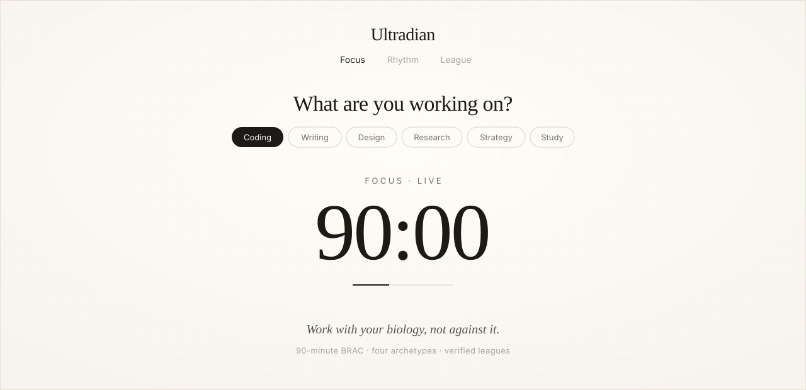
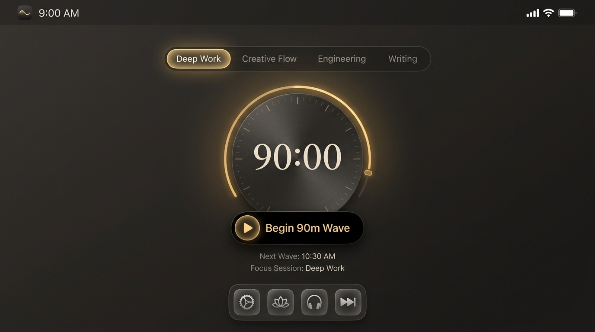
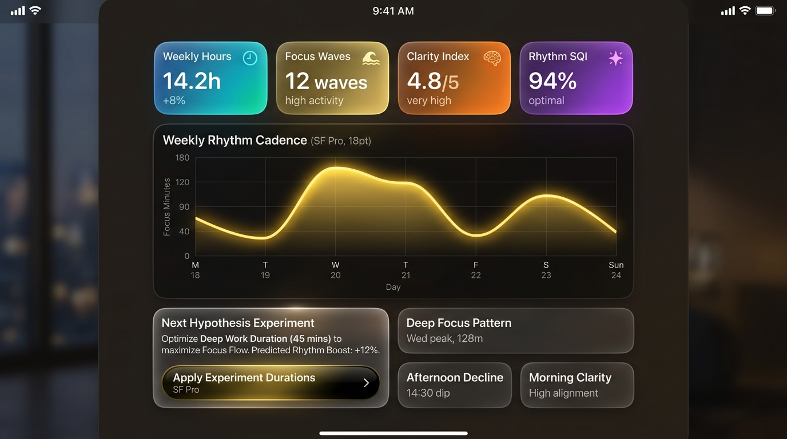
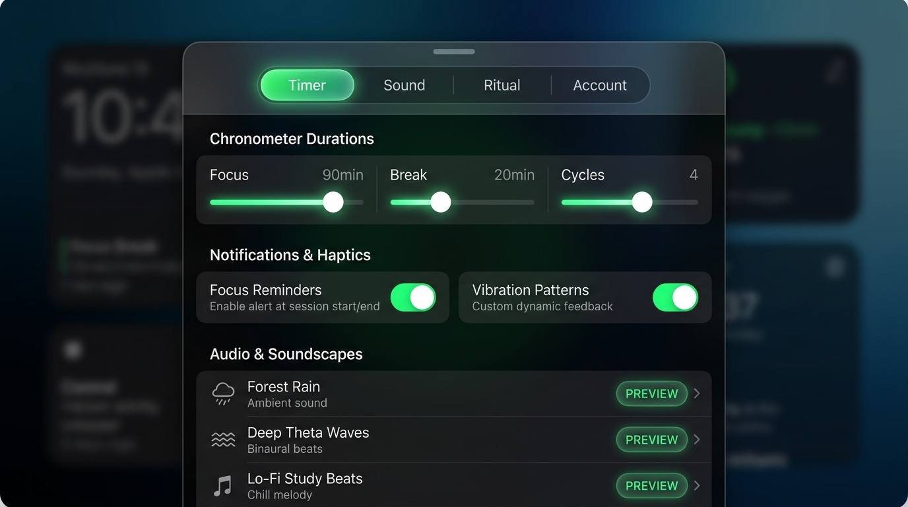
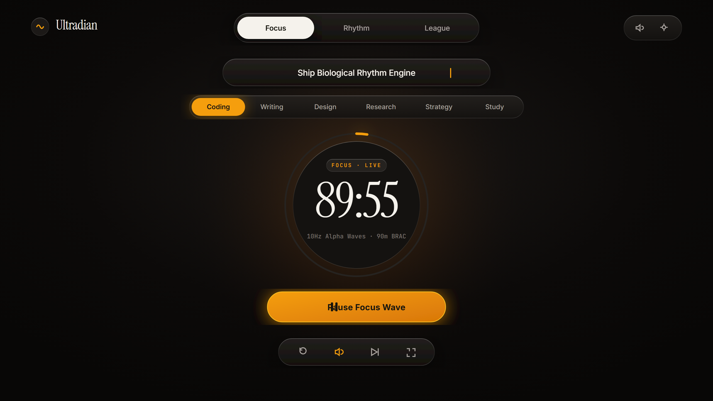

<p align="center">
  <picture>
    <source media="(prefers-color-scheme: dark)" srcset="assets/readme/banner-dark.svg">
    
  </picture>
</p>

<p align="center">
  
</p>

<p align="center">
  
</p>

<p align="center">
  
</p>

<p align="center">
  <a href="#-the-biological-thesis">The Science</a> •
  <a href="#-visual-showcase">Showcase</a> •
  <a href="#-three-rooms">Three Rooms</a> •
  <a href="#-cognitive-archetypes">Archetypes</a> •
  <a href="#-session-quality-index-sqi">SQI Formula</a> •
  <a href="#-system-architecture">Architecture</a> •
  <a href="#-quickstart">Quickstart</a>
</p>

<br />

---

## 🌊 Overview

**Ultradian** is a high-performance focus engine engineered around the natural rhythms of human biology.

Conventional productivity software treats human attention like an electrical machine: constant, linear, and indefinitely sustainable across 8-hour blocks. In reality, human cognitive capacity fluctuates in cyclical waves of roughly 90 to 120 minutes — a biological phenomenon discovered by sleep researcher Nathaniel Kleitman known as the **Basic Rest-Activity Cycle (BRAC)**.

Ultradian eliminates kitchen-timer clutter in favor of an **authentic Apple SwiftUI / iOS 18 fluid spring aesthetic**, liquid glassmorphic materials, procedural Web Audio soundscapes, and an institutional Session Quality Index (SQI) ledger.

<br />

---

## 🎬 Visual Showcase & Walkthrough

<p align="center">
  <video src="https://github.com/REX-codebase/Ultradian/raw/main/assets/readme/ultradian.mp4" controls="controls" width="100%" poster="assets/readme/ultradian-poster.png" style="border-radius: 16px; border: 1px solid rgba(255,255,255,0.1); box-shadow: 0 20px 40px rgba(0,0,0,0.4);">
    <a href="https://github.com/REX-codebase/Ultradian/raw/main/assets/readme/ultradian.mp4">
      
    </a>
  </video>
</p>

<p align="center">
  <a href="https://github.com/REX-codebase/Ultradian/raw/main/assets/readme/ultradian.mp4">
    <strong>▶ Watch Full High-Definition Video Walkthrough (<code>assets/readme/ultradian.mp4</code>)</strong>
  </a>
</p>

<p align="center"><em>End-to-end walkthrough: Selecting a cognitive domain, auditioning harmonic Alpha binaural beats, running a 90m BRAC wave with the living chronometer dial, computing SQI scores, reading weekly rhythm cadence waveforms, and tracking tribal standings.</em></p>

<br />

### Interface Design

| Focus Stage (The Living Instrument) | Rhythm Intelligence (The Ledger) |
| :---: | :---: |
|  |  |
| *Precision chronometer, Dynamic Island CTA, and segmented domain track.* | *Apple Health-style squircle metrics, 7-day cadence waveform, and AI hypothesis card.* |

<br />

| iOS 18 Inset Grouped Settings Sheet | Zen Shield Mode |
| :---: | :---: |
|  |  |
| *Native spring toggle switches, grouped soundscapes, and fluid segmented tab slider.* | *Distraction-free watchmaker dial with guided box breathing overlays.* |

<br />

---

## 🧬 The Biological Thesis

```
Cognitive Energy
      ▲
  100%│        ╭─────────────╮ (Peak Flow Zenith)
      │       ╱               ╲
   50%│      ╱                 ╲                    ╭─────────────╮
      │     ╱                   ╲                  ╱               ╲
    0%│────╯                     ╰────────────────╯                 ╰────► Time (Minutes)
      0                         90               110               200
      ◄─────── Active Focus Wave ───────►◄── Recovery ──►◄── Wave 2 ───►
```

1. **The 90-Minute Basic Rest-Activity Cycle (BRAC)**: Brain wave frequencies (beta, alpha, and theta oscillations) transition through cycles of alertness and fatigue. Forcing focus past biological saturation results in diminished returns and burnout.
2. **Progressive Cognitive Overload**: Stamina is cultivated over time. Ultradian unlocks longer immersion waves sequentially:

| Level | Tier Name | Focus Duration | Active Rest | Deep Recovery |
| :--- | :--- | :---: | :---: | :---: |
| **Level 1** | Apprentice | **45 min** | 10 min | 20 min |
| **Level 2** | Adept | **60 min** | 15 min | 25 min |
| **Level 3** | Ultradian Master | **90 min** | 20 min | 30 min |
| **Level 4** | Flow State Peak | **110 min** | 25 min | 35 min |

<br />

---

## 🏛️ The Three Rooms

Ultradian is structured into three dedicated surfaces designed around singular cognitive intents:

```
                                  ┌────────────────────────┐
                                  │    ULTRADIAN ENGINE    │
                                  └───────────┬────────────┘
                                              │
                    ┌─────────────────────────┼─────────────────────────┐
                    │                         │                         │
                    ▼                         ▼                         ▼
        ┌───────────────────────┐ ┌───────────────────────┐ ┌───────────────────────┐
        │       1. FOCUS        │ │       2. RHYTHM       │ │       3. LEAGUE       │
        │    The Instrument     │ │      The Ledger       │ │       The Tribe       │
        ├───────────────────────┤ ├───────────────────────┤ ├───────────────────────┤
        │ • Chronometer Dial    │ │ • 4-Vector SQI Score  │ │ • Verified Standings  │
        │ • Dynamic Island CTA  │ │ • Cadence Waveforms   │ │ • Ghost Rival Pacing  │
        │ • Web Audio Synthesis │ │ • Gemini Reflection   │ │ • Anti-Cheat Filters  │
        │ • Zen Shield Mode     │ │ • Adaptive Hypotheses │ │ • Cloud Roster Sync   │
        └───────────────────────┘ └───────────────────────┘ └───────────────────────┘
```

### 1. Focus — The Living Instrument
* **Minimalist Chrono Dial**: Watchmaker-calibrated dial with custom serif typography and continuous progress tracking.
* **Dynamic Island Pill CTA**: Liquid sheen glass button with physics-based Play/Pause icon morphing.
* **Segmented Domain Selector**: Continuous sliding track (`Coding`, `Writing`, `Design`, `Research`, `Strategy`, `Study`, `General`).
* **Procedural Web Audio Engine**: Zero external audio dependencies. Generates continuous mathematical noise waves directly in browser:
  * 🧠 **Alpha Binaural Beats (10Hz)**: Optimal for analytical reasoning and coding flow.
  * 🌊 **Theta Waves (6Hz)**: Deep creativity, divergent synthesis, and writing.
  * 🌧️ **Forest Rain & Pink Noise**: Attenuated high-frequency masks for noise reduction.
  * 🌌 **Deep Space & Brown Noise**: Low-frequency rumble for sustained immersion.
* **Zen Shield Mode**: Fullscreen blackout focus shield with interactive 4-4-4-2 box breathing guide.

### 2. Rhythm — The Biological Ledger
* **Session Quality Index (SQI)**: Multi-axis 0–100 quality scoring derived immediately upon wave completion.
* **Weekly Cadence Waveforms**: Area chart visualising minutes completed across rolling 7-day cycles.
* **Gemini 2.0 AI Synthesis**: Server-side LLM reflection evaluating self-reported focus notes, patterns, and fatigue signs.
* **Hypothesis Experiment Engine**: Recommends personalized schedule tweaks (e.g. *"Shift afternoon wave by +15m to match peak clarity"*).

### 3. League — The Verified Tribe
* **Competitive Divisions**: 7 rank tiers (*Wood → Bronze → Silver → Gold → Platinum → Diamond → Ultradian Master*).
* **Ghost Rival Pacing**: Dynamic benchmark tracking the exact minutes needed to overtake the immediate rival ahead.
* **Integrity Guard**: Sample, synthetic, and unverified mock sessions are strictly stripped from global rankings.

<br />

---

## 🧭 Cognitive Archetypes

During onboarding, users calibrate their profile to establish tailored baseline wave durations, harmonic soundscapes, and circadian rhythm anchors:

| Archetype | Focus Profile | Default Wave | Default Soundscape | Circadian Zenith | Motto |
| :--- | :--- | :---: | :---: | :---: | :--- |
| 🛠️ **Builder** | Engineers, Architects, Craftsmen | **60m / 15m** | Deep Brown Noise | Morning Zenith (09:00) | *"Build with precision."* |
| 🎨 **Creator** | Writers, Designers, Artists | **45m / 10m** | Harmonic Rain | Dawn Awakening (06:00) | *"Shape the raw idea."* |
| 🔬 **Scientist** | Researchers, Analysts, Scholars | **90m / 20m** | Alpha Binaural | Solar Zenith (13:00) | *"Question the assumption."* |
| ♟️ **Strategist** | Founders, Executives, Planners | **50m / 10m** | Deep Space | Evening Clarity (18:00) | *"Chart the horizon."* |

> Ultradian contains **120+ specialized profession mappings** spanning software architecture, quantitative finance, neurobiology, design systems, and creative direction.

<br />

---

## 📊 Session Quality Index (SQI)

Rather than naive countdown tracking, Ultradian computes an objective quality score after every wave:

$$\text{SQI} = w_f \cdot S_{\text{focus}} + w_c \cdot S_{\text{completion}} + w_s \cdot S_{\text{shield}} + w_e \cdot S_{\text{energy}}$$

$$\text{SQI} = (0.40 \times \text{Rating}_{1\text{--}5}) + (0.25 \times \text{Completion}\%) + (0.20 \times \text{DistractionPenalty}) + (0.15 \times \Delta\text{Energy})$$

| SQI Score | Tier Classification | Physiological Meaning |
| :---: | :--- | :--- |
| **90 – 100** | 🌟 **Deep Synchrony** | Optimal neural flow state; zero cognitive friction. |
| **75 – 89** | ⚡ **Solid Build** | High productivity with minor environmental friction. |
| **60 – 74** | 🌿 **Restorative Flow** | Steady progress; signals approaching rest necessity. |
| **< 60** | ⚠️ **Fragmented Focus** | High interruptions; rest wave recommended immediately. |

<br />

---

## 🏗️ System Architecture

```mermaid
flowchart TB
    subgraph Browser Client [Frontend Client · React 19 & Tailwind 4]
        A[HomeCommandCenter] --> B[Chronometer Engine]
        A --> C[Segmented Category Pill Bar]
        A --> D[Dynamic Island Master CTA]
        E[Web Audio API Engine] --> F[Procedural Binaural / Noise Synth]
        G[AnalyticsDashboard] --> H[Recharts Waveforms & SQI Ledger]
        I[SettingsModal & Sheet] --> J[Recessed Background & iOS Toggles]
    end

    subgraph Server Middleware [Express Backend · Port 3000]
        K[Vite Dev Middleware]
        L[POST /api/gemini/analyze-session]
        M[POST /api/gemini/weekly-rhythm]
    end

    subgraph Cloud Infrastructure [Firebase & Google GenAI]
        N[Firebase Auth]
        O[Firestore Database]
        P[Cloud Functions]
        Q[Google Gemini 2.0 Flash]
        R[Firebase App Check]
    end

    Browser Client <--> Server Middleware
    Browser Client <--> Cloud Infrastructure
    Server Middleware <--> Q
```

### Key Engineering Principles
- **SwiftUI Spring Physics**: All transitions utilize physical damping, stiffness, and mass parameters (`motion/react`).
- **Zero-Dependency Soundscapes**: Procedural pink, brown, and binaural audio generated in real-time via `AudioContext` buffer nodes.
- **Code-Splitting & Lazy Loading**: Modals, analytics dashboards, and flex card generators are loaded asynchronously through `React.lazy` and `Suspense`.
- **Offline First**: Full functionality is maintained offline using cached local ledgers and persistent IndexedDB storage.

<br />

---

## 🚀 Quickstart

### Prerequisites
* **Node.js** 22.0+ 
* **npm** 10.0+

### 1. Clone & Install
```bash
git clone https://github.com/REX-codebase/Ultradian.git
cd Ultradian
npm install
```

### 2. Environment Configuration
```bash
# macOS / Linux
cp .env.example .env

# Windows PowerShell
Copy-Item .env.example .env
```

| Variable | Required | Description |
| :--- | :---: | :--- |
| `GEMINI_API_KEY` | Optional | Unlocks Gemini 2.0 Flash session reflection & weekly rhythm narratives. |
| `APP_URL` | Optional | Custom base URL for social flex card sharing and OAuth callbacks. |
| `VITE_FIREBASE_*` | Optional | Custom Firebase production configuration overrides. |

### 3. Launch Development Server
```bash
npm run dev
```
Open **[http://localhost:3000](http://localhost:3000)** in your browser.

<br />

---

## 🛠️ Scripts & Tooling

```bash
# Development server (Express + Vite on :3000)
npm run dev

# Compile production bundle & server
npm run build

# Start production server
npm start

# Run full Vitest suite with thread pool
npm test

# Run Playwright end-to-end test suite
npm run test:e2e

# Run TypeScript static typecheck
npm run lint

# Bundle size composition visualizer
npm run analyze
```

<br />

---

## 🔒 Privacy & Non-Biological Commitment

* **Zero Invasive Tracking**: Ultradian **never** accesses cameras, microphones, biometric wearables, or gaze-tracking hardware.
* **Self-Reported Integrity**: All metrics, SQI scores, and rhythm trends are calculated solely from user-reported ratings and timer timestamps.
* **Local Ledger Option**: Complete focus tracking functions privately offline without requiring account creation or cloud sync.

<br />

---

## 📄 License

Distributed under the **MIT License**. See [`LICENSE`](file:///c:/Users/hp1/Ultradian/LICENSE) for details.

<p align="center">
  <sub>Engineered for deep work, biological synchrony, and cognitive longevity.</sub>
</p>
